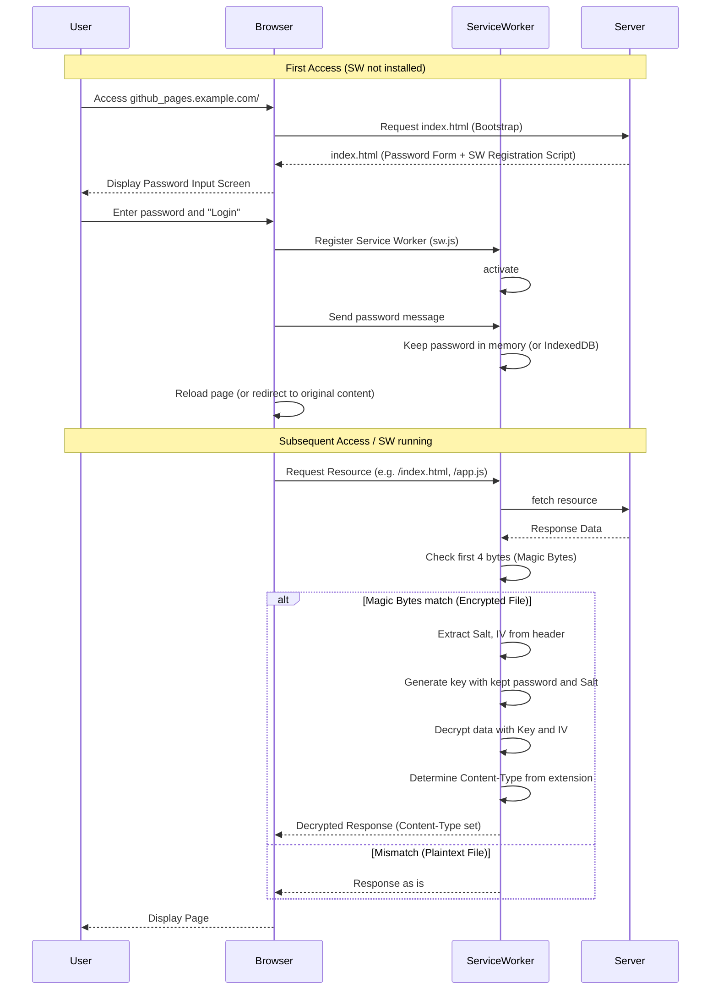

# Instant Lock

> [!WARNING]
> This project is experimental and is not intended for production use.

This is a library that uses Service Worker to create GitHub Pages that require a password upon access.

This library encrypts all resources using AES, making it difficult to easily view the contents from the GitHub repository.
Additionally, by performing AES decryption in the browser, it achieves an appearance as if authentication was performed once the password is entered.

### Limitations
- It is not authentication, but merely simple **obfuscation**. It provides only as much comfort as publishing an encrypted ZIP file.
- It can only be used in browsers where Service Worker runs.

#### Why "obfuscation"
This mechanism has the following characteristics:

- The file itself is accessible to anyone.
- The decryption logic is clear in the source code.
- Brute-force attacks are possible.

It is a mechanism unrelated to security, passing decryptable data to anyone without authenticating the requesting user.

## Demo

You can check the actual password-protected site:

👉 **https://hnisiji.github.io/**

🔑 **Password**: `password123` (Intentionally "weak" password for demo purposes)

### Demo Repository Structure

*   **Source Code**: [hnisiji/hnisiji.github.io_source](https://github.com/hnisiji/hnisiji.github.io_source)
    *   Manages source files and GitHub Actions workflow.
*   **Published Site**: [hnisiji/hnisiji.github.io](https://github.com/hnisiji/hnisiji.github.io)
    *   Contains automatically deployed encrypted artifacts.

## Technical Mechanism

### Encryption Specification
Uses random Salt and IV instead of fixed values.
Also, to distinguish from unencrypted files (plaintext), magic bytes are added to the beginning.

1.  **Key Generation (PBKDF2)**:
    *   Generates an encryption key using the user-input `password` and randomly generated `salt`.
    *   Algorithm: `PBKDF2-HMAC-SHA256`, Iterations: 100,000+
2.  **Encryption (AES-GCM)**:
    *   Encrypts content using the generated key and randomly generated `IV` (Initialization Vector).
    *   Algorithm: `AES-GCM`
3.  **File Format**:
    *   `salt` and `IV` required for decryption are added to the beginning (header) of the encrypted file.
    *   `[Magic Bytes (4bytes)] + [Salt (16bytes)] + [IV (12bytes)] + [Encrypted Data]`
    *   **Magic Bytes**: `0x49 0x41 0x47 0x50` (ASCII "IAGP")

### Decryption Sequence



## Getting Started

Procedures for local development and verification. Uses Docker and Docker Compose.

### Prerequisites
- Docker
- Docker Compose

### Steps

1. **Start Environment**
   Use `docker-compose.yml` in the `examples` directory to start the encryption and delivery server.
   ```bash
   cd examples
   docker-compose up --build
   ```
   This command performs the following:
   - Installs dependencies and builds the entire project.
   - Encrypts files in `examples/site` and outputs them to `examples/dist`.
   - Starts an Nginx server to serve the content of `examples/dist`.

2. **Verification**
   Access `http://localhost:8080` in your browser.
   - The password input screen is displayed upon first access.
   - Enter password `password123` to log in.
   - Encrypted content is decrypted and displayed.

3. **Development Cycle**
   - Modify source code (`packages/`).
   - Re-run `docker-compose up --build` in the `examples` directory to reflect changes.

## Usage

```bash
npx @instant-lock/cli encrypt -i ./docs -o ./encrypted -p mysecretpassword -t "My Private Docs"
```

This will encrypt all files in `./docs` and output them along with the password input page to `./encrypted`.

## Integration into CI/CD Pipeline

You can automate the process from building source code to encryption and deployment using CI/CD pipelines (such as GitHub Actions).

Below is an example configuration using GitHub Actions to build and encrypt in a Private repository and deploy to a Public repository (GitHub Pages).

### Configuration Example

1. **Public Repository (For Publication)**
   The repository where GitHub Pages will be enabled. Only encrypted files will be placed here.

2. **Private Repository (For Source Code)**
   The repository containing the actual website source code. Build and encrypt here, then deploy to the Public repository.

### Workflow Example (.github/workflows/build-and-deploy.yml)

```yaml
name: Build, Encrypt and Deploy

on:
  push:
    branches: [ main ]

jobs:
  deploy:
    runs-on: ubuntu-latest
    steps:
      - uses: actions/checkout@v3

      # 1. Build Site (e.g. npm run build)
      - name: Build Site
        run: |
          npm install
          npm run build
        # Assuming output is ./dist

      # 2. Encrypt and Prepare
      - name: Encrypt and Prepare
        uses: hnisiji/instant-lock@v1
        with:
          input_dir: './'
          output_dir: './__encrypted_dist'
          password: ${{ secrets.PAGE_PASSWORD }} # Set in Repository Secrets
          # Option: Title of the password inputting screen.
          title: "Restricted Area"

      # 3. Push to Public Repository
      - name: Deploy to Public Repository
        run: |
          cd __encrypted_dist
          touch .nojekyll
          git init
          git config user.name "GitHub Actions Bot"
          git config user.email "actions@github.com"
          git add .
          git commit -m "Deploy"
          git push -f "https://${{ secrets.API_TOKEN_GITHUB }}@github.com/your-github-username/your-public-repo.git" main
```

## Package Structure (For Developers)

This project is a Monorepo structure.

```
.
├── packages/
│   ├── cli/              # Build/Encryption Tool (Node.js)
│   │   ├── src/cryptor/  # Encryption/Decryption Logic
│   │   │   # Wraps Web Crypto API, supports both Node.js and Browser environments
│   │   # Scans input_dir, encrypts files, and places them in output_dir
│   │   # Generates index.html and sw.js for bootstrapping
│   │
│   └── action/           # GitHub Action Definition
│       # Implementation of action.yml and execution scripts
│
├── action.yml            # GitHub Action Definition (Reference to packages/action)
└── README.md             # This file
```
