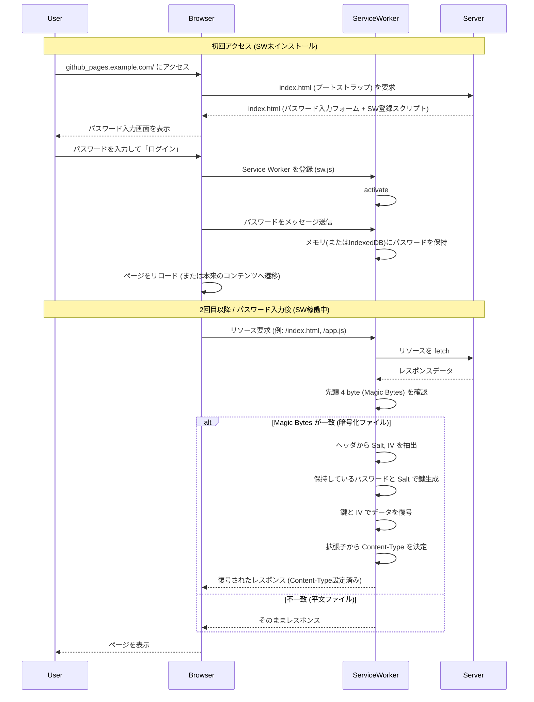

# Instant Lock

> [!WARNING]
> このプロジェクトは実験的なものであり、実運用を想定したものではありません。

Service Worker を使い、アクセス時にパスワードが必要な GitHub Pages を作成するライブラリです。

このライブラリでは、すべてのリソースを AES による暗号化を施すことでコンテンツの中身を簡単には見えないようにします。   
また、AES の復号化をブラウザ上で行うことで、一度パスワードを入れると認証がなされたかのような見え方を実現します。

### 制限事項
- 認証ではなく、あくまで簡易的な **難読化** です。暗号化 ZIP ファイルを公開するぐらいの気休めにしかなりません。
- Service Worker が動くブラウザでしか使えません。

#### なぜ「難読化」なのか
この仕組みには以下の特徴があります。

- ファイル自体誰でもアクセス可能
- 復号ロジックはソースコード上明らか
- 総当たり攻撃が可能

リクエストしているユーザーを認証することなく誰にでも復号しうるデータを渡すという、セキュリティとは無縁の仕組みです。
 
## デモ

実際にパスワード保護されたサイトを確認できます：

👉 **https://hnisiji.github.io/**

🔑 **パスワード**: `password123` (デモ用途のため意図的に「弱い」パスワードにしています)

### デモのリポジトリ構成

*   **ソースコード**: [hnisiji/hnisiji.github.io_source](https://github.com/hnisiji/hnisiji.github.io_source)
    *   ソースファイルと GitHub Actions ワークフローを管理しています。
*   **公開サイト**: [hnisiji/hnisiji.github.io](https://github.com/hnisiji/hnisiji.github.io)
    *   自動的にデプロイされた暗号化済みの成果物が含まれています。

## 技術的な仕組み

### 暗号化の仕様
固定値ではなくランダムな Salt と IV を使用しています。
また、暗号化されていないファイル（平文）との区別のため、先頭にマジックバイトを付与します。

1.  **鍵生成 (PBKDF2)**:
    *   ユーザー入力の `password` と、ランダム生成した `salt` を使用して暗号化キーを生成します。
    *   アルゴリズム: `PBKDF2-HMAC-SHA256`, Iterations: 100,000+
2.  **暗号化 (AES-GCM)**:
    *   生成したキーと、ランダム生成した `IV` (Initialization Vector) を使用してコンテンツを暗号化します。
    *   アルゴリズム: `AES-GCM` 
3.  **ファイルフォーマット**:
    *   復号に必要な `salt` と `IV` は、暗号化されたファイルの先頭（ヘッダー）に付与して保存します。
    *   `[Magic Bytes (4bytes)] + [Salt (16bytes)] + [IV (12bytes)] + [Encrypted Data]`
    *   **Magic Bytes**: `0x49 0x41 0x47 0x50` (ASCIIで "IAGP")

### 復号化時のシーケンス



## 開発の始め方

ローカル環境で開発・検証を行うための手順です。Docker と Docker Compose を使用します。

### 前提条件
- Docker
- Docker Compose

### 手順

1. **環境の起動**
   `examples` ディレクトリにある `docker-compose.yml` を使用して、暗号化と配信サーバーを立ち上げます。
   ```bash
   cd examples
   docker-compose up --build
   ```
   このコマンドにより、以下の処理が行われます：
   - プロジェクト全体の依存関係インストールとビルドが実行されます。
   - `examples/site` 内のファイルが暗号化され、`examples/dist` に出力されます。
   - Nginx サーバーが立ち上がり、`examples/dist` の内容を配信します。

2. **動作確認**
   ブラウザで `http://localhost:8080` にアクセスします。
   - 初回はパスワード入力画面が表示されます。
   - パスワード `password123` を入力してログインします。
   - 暗号化されたコンテンツが復号されて表示されます。

3. **開発サイクル**
   - ソースコード (`packages/`) を修正します。
   - `examples` ディレクトリで `docker-compose up --build` を再実行して変更を反映させます。

## 使い方

```bash
npx @instant-lock/cli encrypt -i ./docs -o ./encrypted -p mysecretpassword -t "My Private Docs"
```

これにより、`./docs` 内のすべてのファイルが暗号化され、パスワード入力ページとともに `./encrypted` に出力されます。

## CI/CD パイプラインへの統合

CI/CD パイプライン（GitHub Actions など）を利用して、ソースコードのビルドから暗号化、デプロイまでを自動化できます。

以下は、GitHub Actions を使用して、Private リポジトリでビルド・暗号化を行い、Public リポジトリ（GitHub Pages）へデプロイする構成例です。

### 構成例

1. **Public Repository (公開用)**
   GitHub Pages を有効にするリポジトリです。ここには暗号化されたファイルのみが配置されます。

2. **Private Repository (ソースコード用)**
   実際のウェブサイトのソースコードを持つリポジトリです。ここでビルドと暗号化を行い、Public リポジトリへデプロイします。

### ワークフロー例 (.github/workflows/build-and-deploy.yml)

```yaml
name: Build, Encrypt and Deploy

on:
  push:
    branches: [ main ]

jobs:
  deploy:
    runs-on: ubuntu-latest
    steps:
      - uses: actions/checkout@v3

      # 1. サイトのビルド (例: npm run build)
      - name: Build Site
        run: |
          npm install
          npm run build
        # 出力先が ./dist だと仮定

      # 2. 暗号化とデプロイ用ファイルの生成
      - name: Encrypt and Prepare
        uses: hnisiji/instant-lock@v1
        with:
          input_dir: './'
          output_dir: './__encrypted_dist'
          password: ${{ secrets.PAGE_PASSWORD }} # Repository Secrets に設定
          # オプション: パスワード入力画面のタイトルなど
          title: "Restricted Area"

      # 3. Public リポジトリへ Push
      - name: Deploy to Public Repository
        run: |
          cd __encrypted_dist
          touch .nojekyll
          git init
          git config user.name "GitHub Actions Bot"
          git config user.email "actions@github.com"
          git add .
          git commit -m "Deploy"
          git push -f "https://${{ secrets.API_TOKEN_GITHUB }}@github.com/your-github-username/your-public-repo.git" main
```

## パッケージ構成 (開発者向け)

このプロジェクトは Monorepo 構成です。

```
.
├── packages/
│   ├── cli/              # ビルド・暗号化ツール (Node.js)
│   │   ├── src/cryptor/  # 暗号化・復号化ロジック
│   │   │   # Web Crypto API をラップし、Node.js/Browser 両対応
│   │   # input_dir を走査し、暗号化して output_dir に配置
│   │   # ブートストラップ用 index.html と sw.js を生成
│   │
│   └── action/           # GitHub Action 定義
│       # action.yml の実体と実行スクリプト
│
├── action.yml            # GitHub Action 定義 (packages/action への参照)
└── README.md             # このファイル
```
